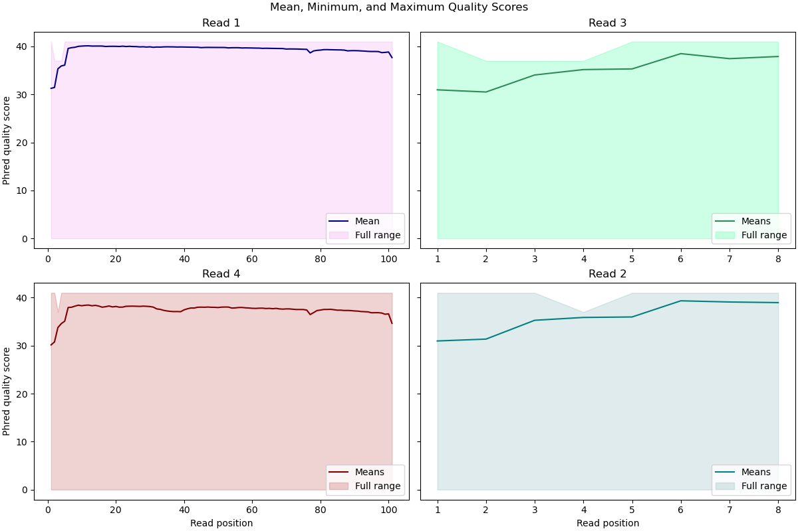

# Assignment the First

## Part 1
1. Be sure to upload your Python script. Provide a link to it here:
[plotting script](quality_hist.py)

| File name                    |               label              | Read length | Phred encoding |
|------------------------------|:--------------------------------:|-------------|----------------|
| 1294_S1_L008_R1_001.fastq.gz | Read 1                           | 101         | Phred+33       |
| 1294_S1_L008_R2_001.fastq.gz | Barcodes corresponding to Read 1 | 8           | Phred+33       |
| 1294_S1_L008_R3_001.fastq.gz | Barcodes corresponding to Read 2 | 8           | Phred+33       |
| 1294_S1_L008_R4_001.fastq.gz | Read 2                           | 101         | Phred+33       


2. Per-base NT distribution
    1. 

    Note that all plots share the same y axis.

    2. When it comes to the index quality I think it's justifiable to be far more permissive. If the index isn't present in the group of 24, it automatically goes to the undetermined file. Thus, the Q score filtering criterion is relevant **only in the case where the barcode does match one of the 24.** Since there are eight bases per barcode, and 4 possibilities for each base, there are 4096 possible barcodes. Thus, even if the bases are randomly picked out of a hat, the probability that a barcode is misread, but coincidentally reads as another of the 24 is very unlikely, because they represent less than 0.6% of the total space of 8 base sequences.
    **For these reasons, I will filter only sequences with a mean Q score below 20.**

    3. 7,304,664 out of 726,493,470 total lines contain Ns.
    
    ```
    zcat 1294_S1_L008_R2_001.fastq.gz 1294_S1_L008_R3_001.fastq.gz | sed -n '2~4p' | grep -E 'N' -v | wc -l
    ```
    
## Part 2
1. Define the problem
	- We are seeking to take reads 1- 4 (each from separate fastq files) and export R1 and R4 into two files, belonging to one of three categories:
		1. Those where the barcodes (R2 and R3) are high quality, and match both those in the table, and each other
			-  These go to a different file for each pair of barcodes (ex GTAGCGTA_R1.fq)
		2. Those where the barcodes are high quality (meet quality score cutoff and do not contain Ns) but do not match, indicating that index hopping has occurred
			- Reads go into hopped_R1.fq and hopped_R2.fq
		3. Those where the reads do match, but the quality score is below the cutoff, or the indices don't match those in the table
			- Reads go into unknown_R1.fq and unknown_R2.fq
2. Describe output
	- We would also like to keep count how many reads go into each of the three categories defined above
		- This output is short, and so will be printed directly to std out
	- We would also like to keep count of all reads in category 1 and 2 above by their ordered barcode pairs 
		- The above output will be longer, and so will be exported to a .tsv file. This file will also have the counts described in the previous bullet point at the top
3. Upload your [4 input FASTQ files](https://github.com/graceHach/Demultiplex/blob/master/TEST-input_FASTQ) and your [>=6 expected output FASTQ files](https://github.com/graceHach/Demultiplex/blob/master/TEST-output_FASTQ).
4. Pseudocode
	- My pseudocode can be found [here](pseudocode.txt)
5. High level functions. For each function, be sure to include:
    1. Description/doc string
    2. Function headers (name and parameters)
    3. Test examples for individual functions
    4. Return statement
    
	- My pseudo-functions can be found [here](pseudofunction.txt) 
